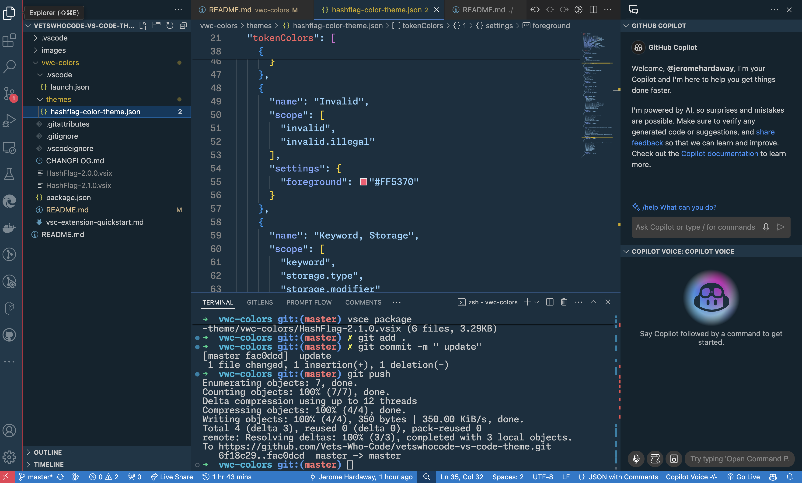

# HashFlag - A Military Inspired VS Code Color Theme by VetsWhoCode

Welcome to HashFlag, a VS Code color theme designed with the valor and spirit of the military in mind. This theme is a tribute to the courage, sacrifice, and honor of our service members, offering users a patriotic coding experience. Brought to you by [VetsWhoCode](https://vetswhocode.io/), a non-profit organization dedicated to helping veterans transition into technology careers, HashFlag stands as a symbol of discipline, respect, and excellence.

## A Salute to Service, A Tool for Innovation

HashFlag is not just a color theme; it's an expression of gratitude to those who have served and a tool for those who continue to innovate. Our colors are inspired by the depth of military uniforms, the bright moments of valor, and the solemnity of service. This theme is designed to inspire and uplift, bringing the essence of camaraderie and the spirit of duty to your development work.

### Features

- **Patriotic Palette**: Experience a color scheme that's visually appealing and emotionally resonant. Navy blues, army greens, and bold accents of red and gold capture the essence of military service and the American flag.
- **Optimized for Readability**: With contrasts designed to reduce eye strain, HashFlag is perfect for long coding sessions, offering comfort and excellence to all users, regardless of their background.
- **Universal Appeal**: HashFlag enhances your workflow whether you're debugging, developing, or dreaming up the next big idea. It's a theme that elevates your work and your workspace.

### Embrace Freedom and Innovation

HashFlag invites you to code with freedom and pride, celebrating the principles and values that veterans have defended. It's an opportunity to express yourself in your work, engage in open-source collaboration, and contribute to meaningful projects. Let this theme remind you of the freedom we cherish and the infinite possibilities within the world of coding.

### How to Install

1. Open VS Code and navigate to `View → Extensions`.
2. Search for `HashFlag` and look for the theme by `VetsWhoCode`.
3. Click `Install`, then `Reload` to refresh your editor.
4. Activate HashFlag by opening the Command Palette with `View → Command Palette` or `Cmd+Shift+P`, type `Theme`, and select `Color Theme → HashFlag`.

### Support Our Mission

By choosing HashFlag, you're not only enhancing your coding environment but also supporting [VetsWhoCode](https://vetswhocode.io/). We empower veterans through technology, offering coding education, mentoring, and career support. Consider making a donation today to help us continue our mission. Your support enables us to serve those who've served, building a bridge from the battlefield to the tech field.

**[Donate to VetsWhoCode](https://vetswhocode.io/donate)**

Join us in making a difference, one line of code at a time.

